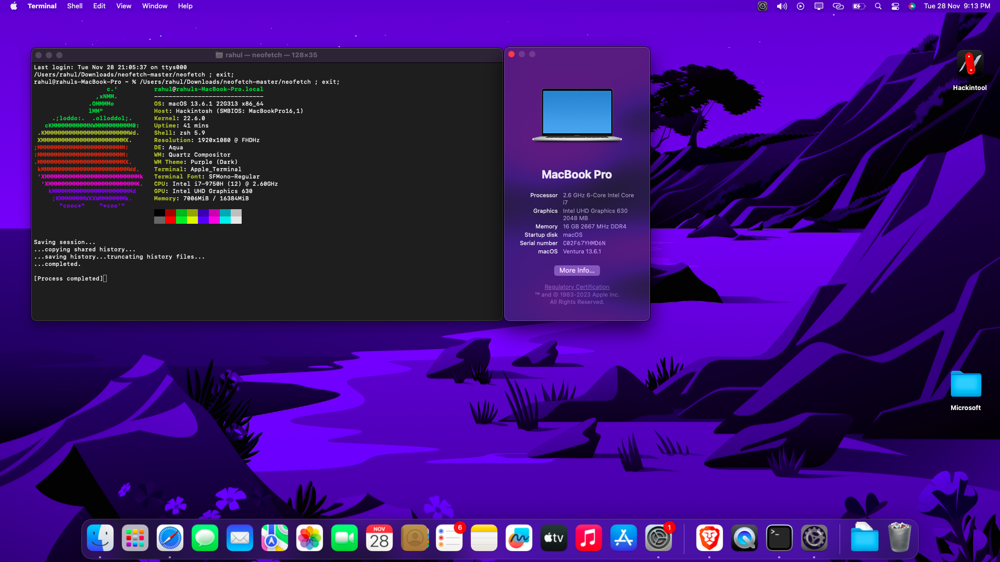
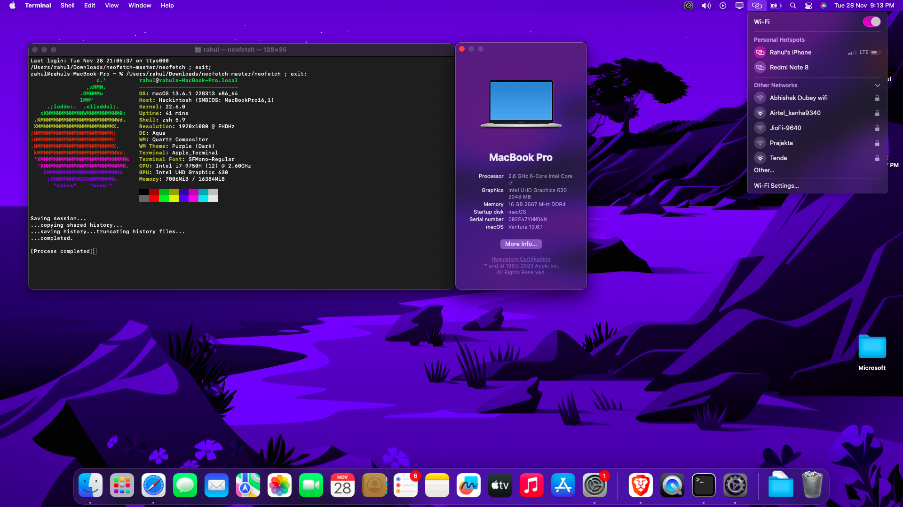

# OpenCore Hackintosh EFI For MSI GF63 Thin 9SCXR 

The EFI is nearly perfect for the MSI GF 63 Thin 9SCXR Tested On  Ventura , although it's not perfect in some aspects, but major things are Fixed and working absolutely fine. Before using this EFI, follow the complete guide.
## Screenshot

## Video

https://github.com/rahulhingve/Hackintosh-MSI-GF63-Thin-9SCXR/assets/62886652/42ea5e65-d824-4129-93fc-fe2bc5de6ee9

# Warning !

**After Booting to macOS Dont Sign Into Apple Account Change The Serial Number  First. IF You Dont Know How to Then follow the following Guide**

**Use Both Guide And Video**

Use THIS In SMBIOS Tools =>    MacBookPro16,1

- Tool Link
https://github.com/corpnewt/GenSMBIOS

-  Guide
https://dortania.github.io/OpenCore-Install-Guide/config-laptop.plist/coffee-lake-plus.html#platforminfo

- Video With TimeStamp
https://youtu.be/jvb-BIMV1Mw?si=a8llG4d1W8aXJb0d&t=2046

## Specs

| Name             | Details                                                                |
| ----------------- | ------------------------------------------------------------------ |
|Model|GF63-Thin-9SCXR|
| CPU | Intel Core i7-9750H   |
| CPU Family |  Coffee Lake  |
| WiFi Chipset |Intel Wireless-AC 9560 160MHz  |
| Audio Codec |  ALC 235  |
| SSD |  KINGSTON OM8PCP3512F-AI1 (500gb) |

## Full Specs

[Click here](https://www.msi.com/Laptop/GF63-Thin-9SCXR/Specification)

## Description

This is an OpenCore-based Hackintosh EFI. Generally, there's only one thing you need to fix after installing macOS, which you can do yourself. However, I would still recommend that you go through all the documentation guides or video guides to understand it a bit so that you also gain knowledge of Hackintosh. If you don't, then...

Used **AirportItlwm** For Wifi fix And Working Fine

Used **IntelBluetoothFirmware** For Fixing Bluetooth

**All Thing Working Perfectly ✌😁**

### Guide Links
https://dortania.github.io/OpenCore-Install-Guide/

https://www.youtube.com/watch?v=jvb-BIMV1Mw  

https://www.youtube.com/watch?v=GGy3V3YT6tI

and some googgling skills.

##  Whats Working 
WiFi      ✅

Bluetooth ✅

Sound    ✅

Keyboard ✅

TrackPad  & trackpad buttons ✅

##  Not Working 
Brightness key ( can be controlled by slidebar May need ACPI PATCH )

## Bugs
- AirDrop  (showing the iphone but tapping on share nothing happens )

- Bluetooth (Not Connecting. Iphone Says MacBook not supported and while using Airpods Pro 2nd gen audio delay and distorted . But working fine with Android  ) 

## BIOS Setting 
### Disable 
- Fast Boot
- Secure Boot
- VT-d
### Enable
- Boot Mode UEFI
- SATA Mode: AHCI
- Hyper-Threading

For more about BIOS Follow This Guide For Detailed Info

https://dortania.github.io/OpenCore-Install-Guide/config-laptop.plist/coffee-lake-plus.html#intel-bios-settings

## Thanks 

- [@VijayIPradhan](https://github.com/VijayIPradhan) for base efi and help
- [Dortania Guide](https://dortania.github.io/OpenCore-Install-Guide/)

